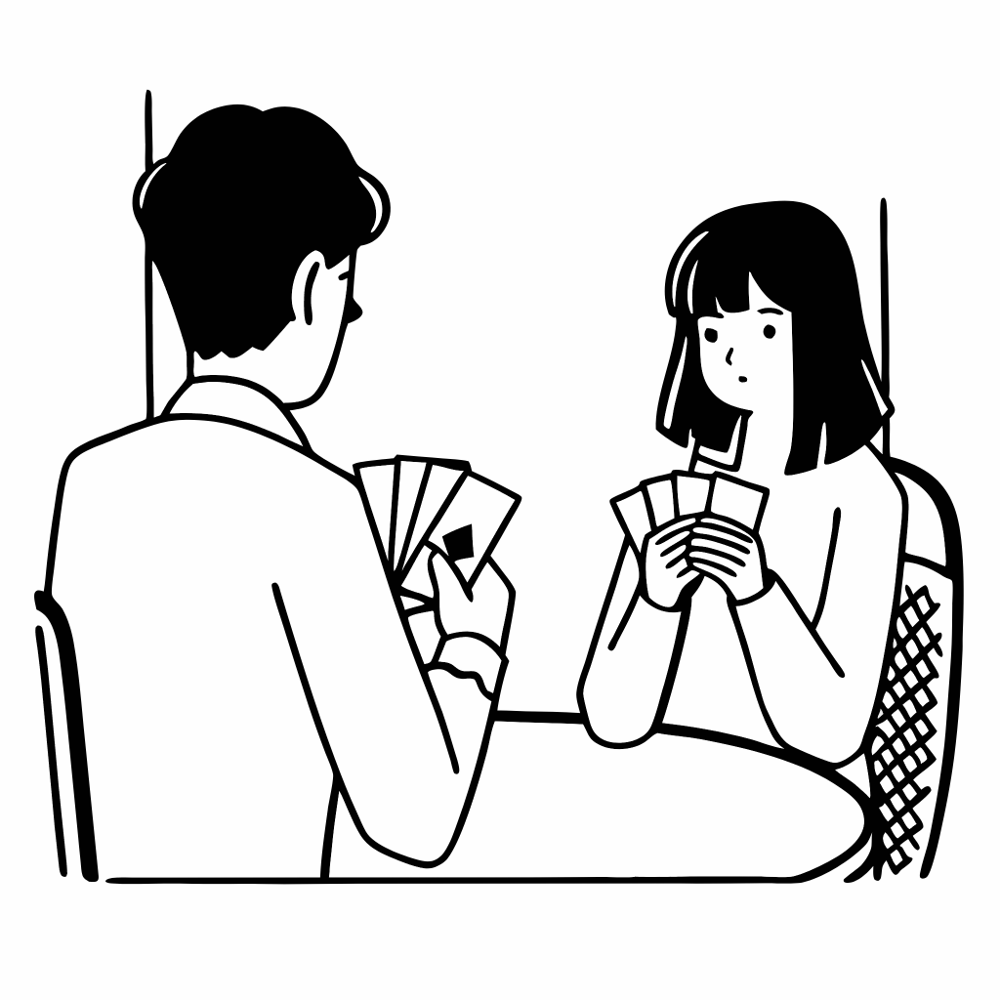

# Talking about Games

## Part 1: Vocabulary Check

| **English Word**          | **Japanese Translation**           |
| :------------------------ | :--------------------------------- |
| 1. board games `___`      | a) 競争心が強い                      |
| 2. cheat `___`            | b) クイズ                           |
| 3. goody-goody `___`      | c) いい子ちゃん                     |
| 4. quiz `___`             | d) いかさまをする                   |
| 5. competitive `___`      | e) ボードゲーム                     |

## Part 2: While You Read/Listen - Main Idea
Instructions: Circle the correct answer.

1. What is the main topic of the conversation?
   a) Their favorite and least favorite types of games
   b) How to win a pub quiz every time
   c) The rules of Monopoly

## Part 3: Read/Listen and Understand

1. Today we're going to talk about [ __________ ].
2. People get really [ __________ ] and competitive with Monopoly.
3. A [ __________ ] is a game where you answer questions.

**Word Box**
| quiz, competitive, games, sporty, aggressive, rules |
|-|

## Part 4: While You Read/Listen - Key Concepts/Details

1. Beth prefers [ __________ ] games in the park.
2. Georgie likes playing card games with friends in the [ __________ ].
3. As a child, Beth played [ __________ ] for many hours.
4. A "goody-goody" is someone who likes to follow the [ __________ ].

**Word Box**
| talking, rules, sporty, board games, Monopoly, pub |
|-|

## Part 6: After You Read/Listen - Think!

1. Is cheating ever acceptable in games if everyone is having fun? Why or why not?

Imagine you're playing a board game with young children who are getting frustrated and upset because they keep losing. Would it be acceptable to "cheat" a little to help them win and keep the game fun for everyone? Explain your answer.

 
 
