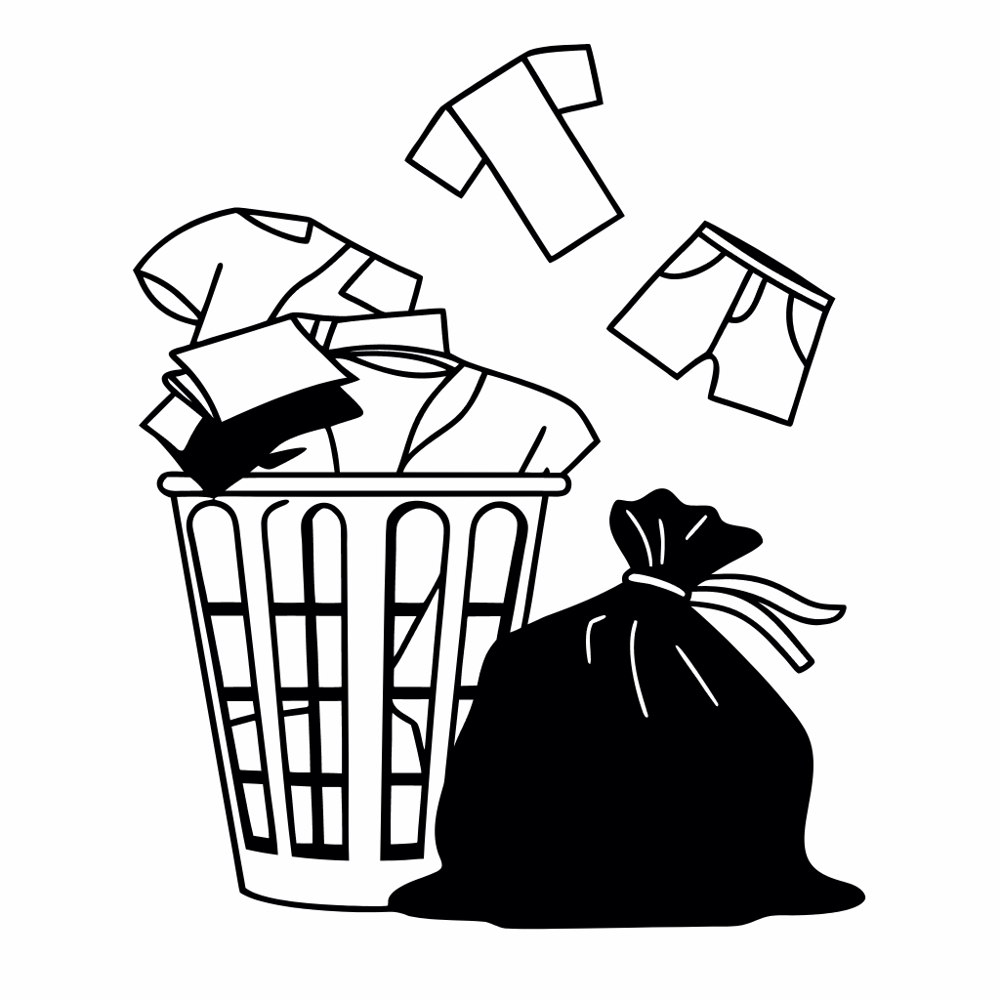
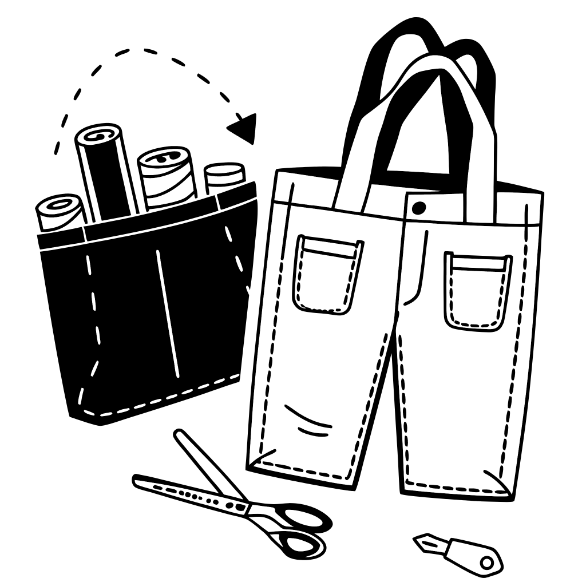
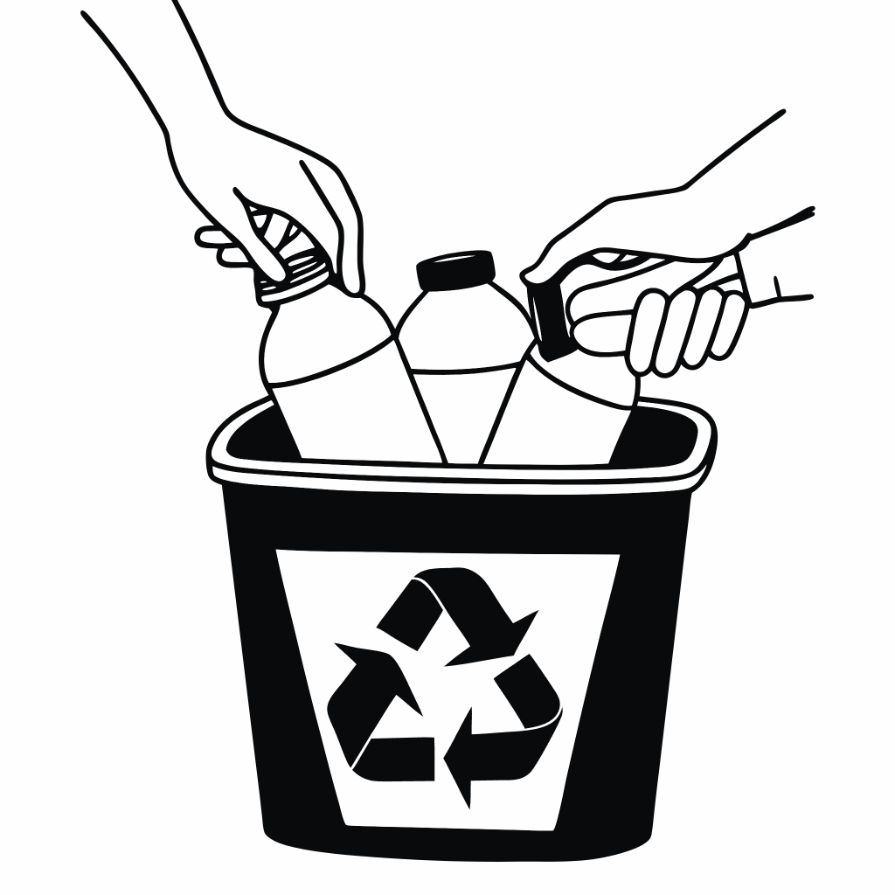
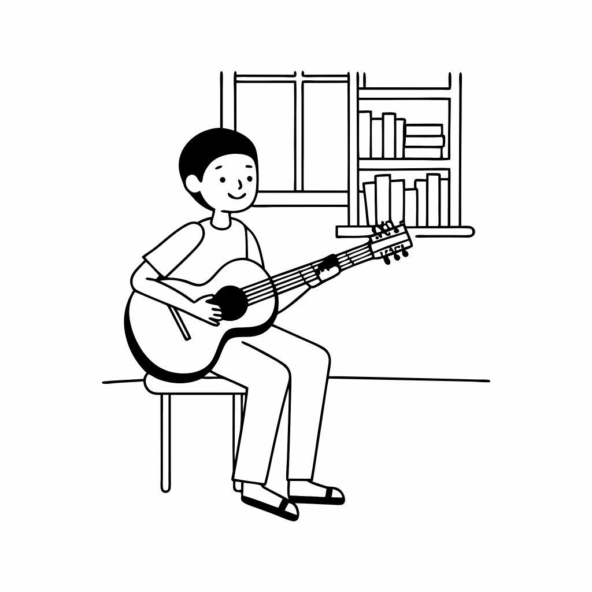
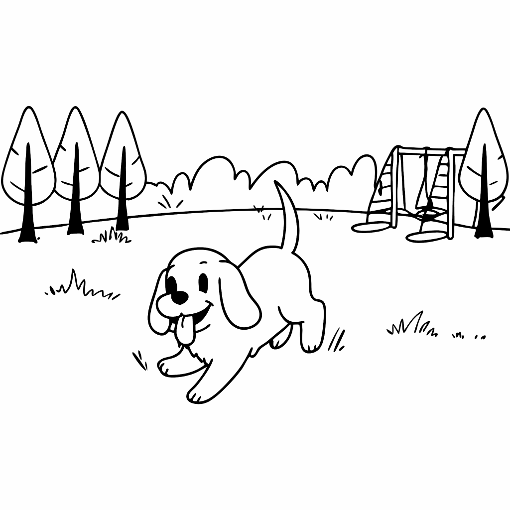
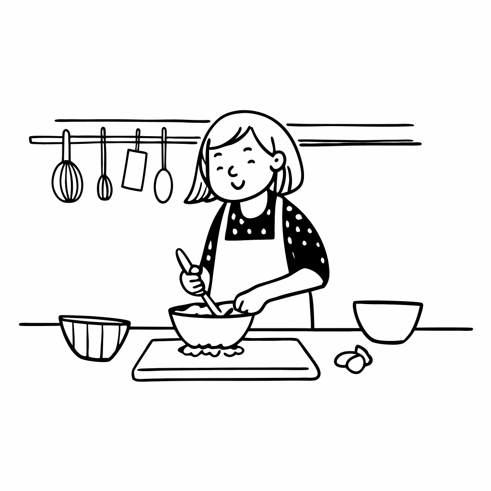
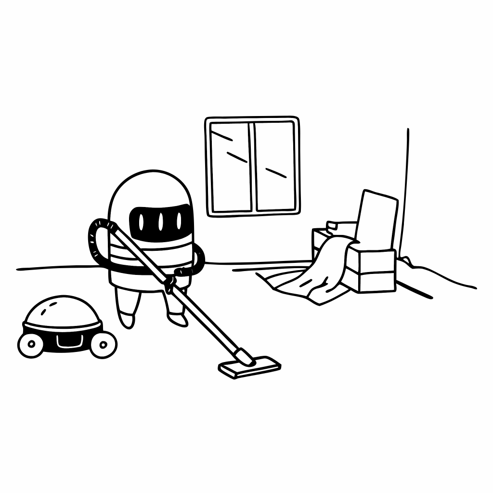

## GS3BC 英語演習　2025-10-16

**1) 以下のスピーチを聞いて、下記の問に答えなさい。** **[知識・技能(8)]**

A. What is Miura-ori?
1. It is a name of solar panels.
2. It is a name of origami paper.
3. It is a way of folding paper.
4. It is a way of drawing a map.

B. Miura-ori is unique because you can ( ).
1. open and close one sheet in one motion
2. fold a large sheet into any kind of shape
3. use the technique in any emergency situation
4. apply it when making solar panels with paper

C. What was Miura-ori applied to when it was brought to space?
1. Solar panels
2. Satellite cameras
3. Airplane wings
4. Robot arms

D. Why is Miura-ori useful for folding a map?
1. It is easy to open and close.
2. It makes maps waterproof.
3. It makes maps smaller than paper.
4. It adds more details to maps.

**2) 以下のスピーチを聞いて、下記の問に答えなさい。** **[知識・技能(8)]**

A. What did the K-pop group do recently?
1. They saw an SDGs meeting on the Internet.
2. They gave a concert at an SDGs meeting.
3. They made a speech at an SDGs meeting.
4. They created a new song for SDGs.

B. Why did the members wear "eco-friendly" suits?
1. To show that they were cool.
2. To work together with people.
3. To spread the idea of upcycling.
4. To save the cost of their clothes.

C. What does "upcycle" mean according to the conversation?
1. Using waste to create products that are worse than the original ones.
2. Using waste to create products that are better than the original ones.
3. Recycling products in the same way as before.
4. Throwing away old clothes and buying new ones.

D. Which image best represents "upcycle"?
1. Image A
2. Image B
3. Image C
4. Image D

<table style="width:100%; table-layout:fixed; border-collapse:collapse; text-align:center; font-size:0.9em;">
  <tr>
    <th style="padding:6px; border:1px solid #000;">Image A</th>
    <th style="padding:6px; border:1px solid #000;">Image B</th>
    <th style="padding:6px; border:1px solid #000;">Image C</th>
    <th style="padding:6px; border:1px solid #000;">Image D</th>
  </tr>
  <tr>
    <td style="padding:8px; vertical-align:top; border:1px solid #000;">
      
    </td>
    <td style="padding:8px; vertical-align:top; border:1px solid #000;">
      
    </td>
    <td style="padding:8px; vertical-align:top; border:1px solid #000;">
      
    </td>
    <td style="padding:8px; vertical-align:top; border:1px solid #000;">
      
    </td>
  </tr>
</table>

**3) ２人の会話を聞き、下記の問いに答えなさい。** **[知識・技能(8)]**

A.What is the main topic of the conversation?
1. Ways people deal with waste and reduce single-use plastics
2. How to cook at home cheaply
3. Tourist attractions in London
4. Ways to cook at home cheaply

B. We [ __________ ] [ __________ ] plastic a lot in our daily lives.
C. Almost everybody [ __________ ] a bottle.
D. I want to [ __________ ] [ __________ ] my use of clingfilm.

**4) 以下の単語に対応する日本語を選びなさい。** **[知識・技能(20)]**

| **Words**                 |                  |
| :------------------------ | :------------------------ |
| 1. waste                  | 6. sightseeing            |
| 2. recycle                | 7. leftovers              |
| 3. day trip               | 8. hangry                 |
| 4. budget                 | 9. shop around            |
| 5. get up                 | 10. oversleep             |

| a: 残り物&emsp; b: 観光&emsp; c: リサイクルする&emsp; d: 空腹でイライラした&emsp; e: 予算&emsp; f: 寝過ごす&emsp; g: 価格を比べる&emsp; h: 起きる&emsp; i: 日帰り旅行&emsp; j: 廃棄物&emsp;|
|:-|

**5) 以下の文章を読み、下記の問いに答えなさい。** **[知識・技能(12)/思考・判断・表現(10)]**

Today, we will talk about some names of animals and the meat that we eat. (&emsp; ① &emsp; ) take pigs, cows, and sheep, for example. (&emsp; ② &emsp; ) we mention these animals as meat, their names change. On the farm, a pig is called a pig, but in a sandwich, it is called pork. (&emsp; ③ &emsp; ), cows turn into beef. Sheep turn into mutton. Why do these animals have different names when they are cooked for a meal? The answer is related to British history. (&emsp; ④ &emsp; ) the 11th century, many people in present-day France came to England. So, many French words became part of the English language. When animals were on the farm, they kept their old English names such as pig, cow, and sheep. (&emsp; ⑤ &emsp; ) when they were cooked and brought to the table, the English versions of the French words were used, such as pork, beef, and mutton. Today, (&emsp; ⑥ &emsp; ) of origin, modern English speakers use both groups of words.

A. 本文中の①〜⑥に当てはまる適切な単語を書きなさい。

B. Which is NOT mentioned in the radio program?
1. Pork.
2. Beef.
3. Mutton.
4. Chicken.

C. Why does English have two groups of names for animals?
1. Because there were two different names for animals in French.
2. Because Old English replaced French in the 11th century.
3. Because many French words became part of English.
4. Because England was divided into two parts.

D. When did French words become part of the English language?
1. In the 10th century.
2. In the 11th century.
3. In the 12th century.
4. In the 13th century.

E. What are other meats that have different names from their animal names in English?
1. Deer.
2. Duck.
3. Chicken.
4. Fish.

F. Think of a word that has two different meanings in English and write it down on your answer sheet.
   For example, "bat" can mean "野球のバット" or "コウモリ".

**6) 以下の文章を読み、下記の問いに答えなさい。** **[知識・技能(4)/思考・判断・表現(8)]**

Caroline: Hi Ben, I have tickets for the Nazca Cultural Show. Do you want to come with me?
Ben: Sure, but I don't know much about Nazca culture. What can we see there?
Caroline: Nazca culture is famous for the Nazca Lines. I think we can see many photos of the lines.
Ben: Oh, I've seen those lines on TV. They are amazing, aren't they?
Caroline: Yes, they are. In the show, with virtual technology, we can experience viewing the lines from the sky.
Ben: Wow, sounds exciting.
Caroline: Also, we can see many kinds of arts and crafts. Among them, you shouldn't miss the mask (&emsp; ① &emsp;) gold. It's very famous.
Ben: I definitely want to see it. People from that time produced advanced arts and crafts.
Caroline: Yes, they also made a very colorful cloth with a beautiful design on it.
Ben: I'm really (&emsp; ② &emsp; ) going to the show. I can't wait.

A . 本文中の①、②の空白に当てはまる適切な語を記述しなさい。
　　　① 〜で作られた　（２語）
　　　② 楽しみにしている　（3語）

B . What can people do in the Nasca cultural show?
1.  They can take photos of the Nasca Lines.
2.  They can talk with an expert of the Nasca Lines.
3.  They can join a TV show about the Nasca Lines.
4.  They can view the Nasca Lines virtually from the sky.

C . What can people see in the show?
1.  A mask made of gold.
2.  A beautiful gold cloth.
3.  Advanced painting skills.
4.  Famous lines on arts and crafts.

D . How does Ben feel about going to the show?
1.  He is not interested because he doesn't know about Nazca culture.
2.  He is worried because he has never seen the Nazca Lines before.
3.  He is excited and looking forward to the experience.
4.  He is confused about what they will see at the show. 

E : Write your own opinion. Do you want to go to the Nasca cultural show? Why or why not?

**7) 以下はAIで生成された画像です。** **[思考・判断・表現(10)]**

A: (1)〜(4)はそれぞれ何をしているかを主語を明確にした上で、現在進行形で答えなさい。
B: (1)を「男の子がトランペットを演奏している」に変更したい場合、どのような修正をAIに指示しますか。"make"を使って答えなさい。

<table style="width:100%; table-layout:fixed; border-collapse:collapse; text-align:center; font-size:0.9em;">
  <tr>
    <th style="padding:6px; border:1px solid #000;">(1)</th>
    <th style="padding:6px; border:1px solid #000;">(2)</th>
    <th style="padding:6px; border:1px solid #000;">(3)</th>
    <th style="padding:6px; border:1px solid #000;">(4)</th>
  </tr>
  <tr>
    <td style="padding:8px; vertical-align:top; border:1px solid #000;">
      
    </td>
    <td style="padding:8px; vertical-align:top; border:1px solid #000;">
      
    </td>
    <td style="padding:8px; vertical-align:top; border:1px solid #000;">
      
    </td>
    <td style="padding:8px; vertical-align:top; border:1px solid #000;">
      
    </td>
  </tr>
</table>

**8) 以下の設問を読み、英語で自分の考えを20語以上で書きなさい。** **[思考・判断・表現(12)]**

評価観点: 自分の意見の明確さ、文法の正確さ、20語以上で書けているか

1) Is A.I. good or bad for jobs?
2) Should supermarkets stop selling fruit and vegetables wrapped in plastic?
3) Do you think it's always good to look for the cheapest price?