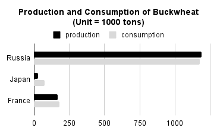
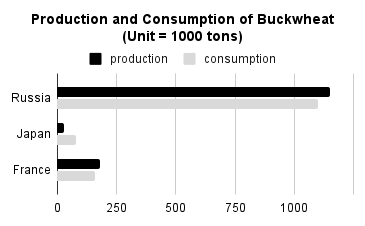
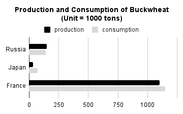

<!--- Section 1: Listening (10 points) --->
<!--- Section 2: Grammar (15 points) --->

##### 2. 次の問い(1)〜(15)の（&emsp;&emsp;&emsp;）に入れるのに最も適当なものを、それぞれ下の1〜4のうちから一つずつ選べ。（各1点）

(1) It (&emsp;&emsp;&emsp;) raining on and off these dozen days.
    1. has been &emsp;&emsp; 2. is &emsp;&emsp; 3. was &emsp;&emsp; 4. had been

(2) Something was wrong with the door; it (&emsp;&emsp;&emsp;) not open.
    1. will &emsp;&emsp; 2. would &emsp;&emsp; 3. shall &emsp;&emsp; 4. should

(3) She (&emsp;&emsp;&emsp;) to see me if she had been able to.
    1. would have come &emsp;&emsp; 2. is coming &emsp;&emsp; 3. had come &emsp;&emsp; 4. came

(4) The beach was beautiful! I wish I (&emsp;&emsp;&emsp;) longer.
    1. have stayed &emsp;&emsp; 2. could have stayed &emsp;&emsp; 3. can stay &emsp;&emsp; 4. will stay

(5) He is (&emsp;&emsp;&emsp;) than clever.
    1. wise &emsp;&emsp; 2. wiser &emsp;&emsp; 3. more wise &emsp;&emsp; 4. wisely

(6) He had his purse (&emsp;&emsp;&emsp;) on the crowded street.
    1. steal &emsp;&emsp; 2. stolen &emsp;&emsp; 3. rob &emsp;&emsp; 4. robbed

(7) (&emsp;&emsp;&emsp;) on hills, Nagasaki has one of the most beautiful settings in Japan.
    1. Build &emsp;&emsp; 2. Building &emsp;&emsp; 3. Built &emsp;&emsp; 4. To build

(8) She asked us, (&emsp;&emsp;&emsp;), whether we thought it was going to clear up in the afternoon.
    1. Ted and I &emsp;&emsp; 2. I and Ted &emsp;&emsp; 3. Ted and me &emsp;&emsp; 4. me and Ted

(9) It's not only her friends that Ms. Kinoshita is kind to. She helps (&emsp;&emsp;&emsp;) needs her help.
    1. those &emsp;&emsp; 2. whatever &emsp;&emsp; 3. whoever &emsp;&emsp; 4. whom

(10) The house (&emsp;&emsp;&emsp;) roof is red is my uncle's.
    1. that &emsp;&emsp; 2. where &emsp;&emsp; 3. which &emsp;&emsp; 4. whose

(11) I was very busy (&emsp;&emsp;&emsp;) the homework.
    1. doing &emsp;&emsp; 2. for doing &emsp;&emsp; 3. to doing &emsp;&emsp; 4. to do

(12) The boy screamed for help but couldn't (&emsp;&emsp;&emsp;).
    1. hear him &emsp;&emsp; 2. make himself hear &emsp;&emsp; 3. make him heard &emsp;&emsp; 4. make himself heard

(13) Jane lent me (&emsp;&emsp;&emsp;) last week.
    1. a her book &emsp;&emsp; 2. a book of her &emsp;&emsp; 3. this book of her &emsp;&emsp; 4. this book of hers

(14) Your answer has (&emsp;&emsp;&emsp;) to do with my question.
    1. none &emsp;&emsp; 2. nothing &emsp;&emsp; 3. not &emsp;&emsp; 4. no

(15) There are numerous cases (&emsp;&emsp;&emsp;) Japanese modesty causes misunderstanding.
    1. which &emsp;&emsp; 2. that &emsp;&emsp; 3. where &emsp;&emsp; 4. how

 

<!--- Section 3: Textbook (30 points)　total questions: 20--->
##### 3. 下記の文章を読み、以下の問いに答えなさい。(各2点)

Have you ever heard of "green roofs"? They are roofs of buildings that are covered with plants.

Green roofs are becoming popular  especially in large cities  because they are good for the environment.  In summer,  cities are often hotter  than other areas.  Green roofs keep buildings cool  ①(&emsp;&emsp;&emsp;) electricity.  These buildings produce less CO₂ because they do not use much air conditioning.  Furthermore,  plants on the roofs take in CO₂. 

Green roofs may sound new, but actually they have a long history. In Norway, farmhouses have had grass roofs for centuries. In Japan, people have had straw-roof houses ②(&emsp;&emsp;&emsp;) thousands of years. These traditional roofs show ancient people's wisdom.

In many cities, the natural environment has been replaced ③(&emsp;&emsp;&emsp;) buildings. Green roofs may be an effective way for people in cities to live in harmony with nature.

(1)  文章中の空所①,②,③に最も適切な語句を、それぞれ英語で書き入れなさい。
(2)  Green Roofs が特に大都市で人気になっているのはなぜですか。 日本語で答えなさい。
(3)  Green Roofs は、建物からのCO₂排出量を減らすのにどのように役立ちますか。 日本語で2つ答えなさい。
(4)  Which two countries have traditional green roofs?

 

Do you think *soba* noodles are ①(&emsp;&emsp;&emsp;) to Japan? Soba noodles are made from buckwheat. Actually, it is grown in many countries around the world. The graph shows the production and consumption of buckwheat in three countries in 2016.

As you can see, Russia produces the most buckwheat among the three countries, while Japan produces the least. Likewise, Russia consumes ②(&emsp;&emsp;&emsp;) (&emsp;&emsp;&emsp;) as much buckwheat as Japan does. In Russia, buckwheat is popular, and people often eat a dish called kasha. Kasha is similar to Japanese rice porridge.

Unlike Russia, the consumption of buckwheat in France is higher than its production. France consumes imported buckwheat as well as domestically grown buckwheat. In France, buckwheat is often used for making crepes and pancakes.

Buckwheat is rich in nutrients. Additionally, it grows quickly even in ③(&emsp;&emsp;&emsp;) (&emsp;&emsp;&emsp;). Someday, it might become one of the world's major crops.

(5)  文章中の空所①,②,③に最も適切な語句を、それぞれ英語で書き入れなさい。
(6)  言及されている国の中で、そばの生産量が最も多い国はどこですか。
(7)  そばの二つの良い特徴は何ですか。
(8) 下記のグラフは、そばの生産量と消費量を示しています。最も適切なグラフをA,B,Cの中から選びなさい。
(9) How is buckwheat commonly consumed in Russia?
(10) How are the buckwhaet used in France?

  

    
    
A

  

  

    
    
B

  

  

    
    
C

  

 

Hi, everyone. In our biology class, Ms. Sato mentioned that animals have great ①(&emsp;&emsp;&emsp;). For example, many of you know dogs can smell far ②(&emsp;&emsp;&emsp;) than us. Then, I wondered if other animals have such abilities, so I did some research on birds. They have some amazing abilities. Let me talk about ③(&emsp;&emsp;&emsp;)(&emsp;&emsp;&emsp;) found.

Do you know how fast birds can fly? The fastest one is said to be a falcon, or *hayabusa*. It can fly more than 300 km per hour, especially when it is trying to catch small animals for food. Also, a swallow, or *tsubame*, can fly about 200 km per hour when escaping from an enemy. Because of their speed, their names are used for the Shinkansen.

As I have explained, dogs and birds have great abilities. Other animals also have amazing abilities. We humans should respect all living things on earth.

(11) 文章中の空所①,②,③に最も適切な語句を、それぞれ英語で書き入れなさい。
(12) What is the speed of the fastest bird?
(13) Why are the names of certain birds used for Shinkansen trains?
(14) When does a falcon reach its maximum speed?
(15) What is the speed difference between a falcon and a swallow?

 
<!--- Section 4: CBC Kids News (30 points) --->

##### 4. 以下の単語に対応する日本語を選びなさい。 (各1点)

| **Words**                 |                  |
| :------------------------ | :------------------------ |
| 1. greenhouse gases       | 6. deepfake              |
| 2. atmosphere             | 7. artificial             |
| 3. fossil fuels           | 8. misinformation         |
| 4. tariff                 | 9. borrow                 |
| 5. import                 | 10. interest              |

| a: 関税&emsp; b: 借りる&emsp; c: 人工的な&emsp; d: 大気&emsp; e: 温室効果ガス&emsp; f: 利子&emsp; g: 化石燃料&emsp; h: 輸入&emsp; i: 誤報 / 偽情報&emsp; j: ディープフェイク&emsp;|
|:-|

 

##### 5. 以下の語群から最も適当なものを選び、空欄に入れなさい。 (各1点)

1.  Governments sometimes use tariffs to [ __________ ] [ __________ ] and companies in their own country.
2.  Tariffs can make things more [ __________ ] for people to buy.
3.  The unusual increase of the Earth's surface temperature is called [ __________ ].
4.  Most of the [ __________ ] (CO2) in the atmosphere has come from burning fossil fuels.
5.  Social work needs feelings and [ __________ ]. A.I. does not have these.
6.  Arjun is thinking about A.I. and new [ __________ ] in the workplace.

| tax&emsp; technologies&emsp; emotions&emsp; protect&emsp; expensive&emsp;   carbon dioxide&emsp; country&emsp; global warming&emsp; jobs&emsp; |
|:-|

 

##### 6. 以下の設問を読み、考えを記述しなさい。 (各5点)

\* 評価基準: 自分の意見をもって回答できているか, 文法の正確さ, 20単語以上で書けているかどうか

1.  Are tariffs generally a good or a bad idea?
2.  What is one change people could make in their daily lives to help reduce emissions?
3.  Is A.I. good or bad for jobs?