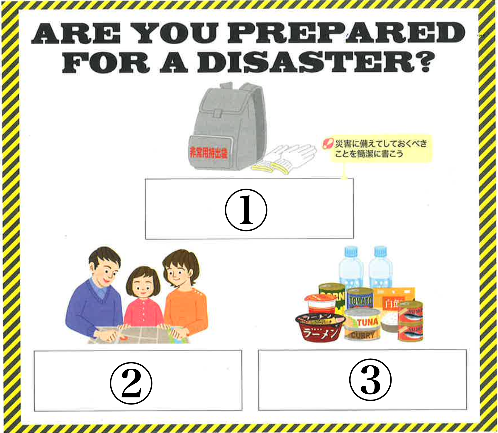

**1) Match the vocabulary to the corresponding Japanese defention from the box below.** **[知識・技能(10)]**

| **Words**                 |                  |
| :------------------------ | :------------------------ |
| 1. greenhouse gases       | 6. sunscreen             |
| 2. atmosphere             | 7. sunburn               |
| 3. fossil fuels           | 8. invisible             |
| 4. global warming         | 9. skin                  |
| 5. emissions              | 10. rays                 |

| a: 日焼け止め&emsp; b: 地球温暖化&emsp; c: 肌&emsp; d: 温室効果ガス&emsp; e: 見えない&emsp;f: 排出物&emsp;　g: 大気&emsp;　h: 光線&emsp; i: 化石燃料&emsp; j: 日焼け&emsp;|
|:-|

 

**2) Fill in the blanks with the appropriate words from the Word Box below.** **[知識・技能(15)]**

1) The glass walls ( &emsp;&emsp;&emsp; ) the sun's heat so plants can stay warm.
2) Most of the ( &emsp;&emsp;&emsp; ) in the atmosphere has come from burning fossil fuels.
3) S-P-F stands for Sun Protection ( &emsp;&emsp;&emsp; ).
4) UVB rays cause ( &emsp;&emsp;&emsp; ).
5) "Broad spectrum" means it protects from ( &emsp;&emsp;&emsp; ) UVA and UVB rays.

| Factor, tan, release, both, oxygen, sunburn, CO$_2$, neither, trap, fun |
| :-- |

 

**3) Fill in the blanks and complete the sentences.** **[知識・技能(30)]**

1) (&emsp;&emsp;&emsp;)(&emsp;&emsp;&emsp;) talk about disaster risks?
   災害のリスクについて話しませんか。
   
2) I (&emsp;&emsp;&emsp;)(&emsp;&emsp;&emsp;)(&emsp;&emsp;&emsp;) join an emergency drill every year.
   私は毎年避難訓練に参加したものです。
   
3) We (&emsp;&emsp;&emsp;)(&emsp;&emsp;&emsp;)(&emsp;&emsp;&emsp;) prepare emergency supplies at home in advance.
   家に前もって防災用品を用意しておいたほうがいい。
   
4) You (&emsp;&emsp;&emsp;)(&emsp;&emsp;&emsp;)(&emsp;&emsp;&emsp;) go out when the typhoon is approaching!
   台風が接近しているときには外出しないほうがいいよ！
   
5) He (&emsp;&emsp;&emsp;)(&emsp;&emsp;&emsp;)(&emsp;&emsp;&emsp;) such expensive emergency supplies.
   買ったはずがない
   
6) 100,000 liters of water (&emsp;&emsp;&emsp;)(&emsp;&emsp;&emsp;)(&emsp;&emsp;&emsp;) to make 100 hamburgers.
   100個のハンバーガーを作るのに、10万リットルの水が必要です。
   
7) If you use this tool, most of the bacteria (&emsp;&emsp;&emsp;)(&emsp;&emsp;&emsp;)(&emsp;&emsp;&emsp;).
   この道具を使えば、ほとんどのバクテリアは除去することができます。
   
8) The water problem in this country (&emsp;&emsp;&emsp;)(&emsp;&emsp;&emsp;)(&emsp;&emsp;&emsp;)(&emsp;&emsp;&emsp;) yet.
   この国における水問題はまだ解決されていない。
   
9) Every student (&emsp;&emsp;&emsp;)(&emsp;&emsp;&emsp;) the emergency drill tomorrow.
   参加しなければならない
   
10) This battery (&emsp;&emsp;&emsp;)(&emsp;&emsp;&emsp;) useful when the power is out.
    役立つだろう
    
11) You (&emsp;&emsp;&emsp;)(&emsp;&emsp;&emsp;)(&emsp;&emsp;&emsp;) a lot about earthquakes.
    学んだにちがいない
    
12) (&emsp;&emsp;&emsp;) this food (&emsp;&emsp;&emsp;) from abroad?
    この食品は外国から輸入されたのですか。
    
13) The window (&emsp;&emsp;&emsp;)(&emsp;&emsp;&emsp;)(&emsp;&emsp;&emsp;) soon.
    修理しなければならない
    
14) You (&emsp;&emsp;&emsp;)(&emsp;&emsp;&emsp;)(&emsp;&emsp;&emsp;) an elevator when an earthquake happens.
    使ってはならない
    
15) The batteries in this portable radio (&emsp;&emsp;&emsp;)(&emsp;&emsp;&emsp;) old.
    古いかもしれない

**4) Read the article below and answer the questions.** **[知識・技能(10)]**

<u>Aravind Srinivas founded Perplexity in 2022</u>(1). <u>The tool uses AI models to give answers</u>(2), and the answers are posted as a summary. <u>People call the company's new web browser Comet</u>(3). However, some news companies have complained. They say <u>their content was copied by the tool</u>(4) without permission.

1.  下線部(1)の文を受動態に書き換えなさい。
2.  下線部(2)の文を受動態に書き換えなさい。
3.  下線部(3)の文を受動態に書き換えなさい。
4.  下線部(4)の文を能動態に書き換えなさい。
5.  受動態で書かれている文の記号を選びなさい。
    a) Aravind Srinivas founded Perplexity.
    b) The tool uses AI models to give answers.
    c) The answers are posted as a summary.
    d) People call the company's new web browser Comet.
	

**5) Read the dialogue and answer the questions.** **[知識・技能(9)/思考・判断・表現(6)]**

**Michael**: Did you read that news article about Iran? The President said the strikes were a total success.
**Kenneth**: I did. But the article says the new report is different. It says the strikes ①(&emsp;&emsp;&emsp;) not have worked as well as he said.
**Michael**: Right. The report says the damage ②(&emsp;&emsp;&emsp;) only delay them for a few months.
**Kenneth**: So, does that mean they might have to do more in the future?
**Michael**: It seems so. It's confusing when leaders and reports say different things.
**Kenneth**: I agree. The public ③(&emsp;&emsp;&emsp;) get clear information.

1.  **Choose the best verb for ①.** 
    a) might  &emsp;&emsp;  b) must &emsp;&emsp; c) would
2.  **Choose the best verb for ②.** 
    a) must &emsp;&emsp; b) may &emsp;&emsp; c) would
3.  **Choose the best verb for ③.**
    a) could &emsp;&emsp; b) should &emsp;&emsp; c) would
4.  **What did the president claim about the strikes?**
    a) They were a partial success.
    b) They were a total success.
    c) They failed to meet their objectives.
    d) They would need to be repeated.
5.  **What does the new report suggest about the damage?**
    a) It will stop the program for years.
    b) It will only delay them for a few months.
    c) It completely destroyed the facilities.
    d) It was more significant than expected.

**6) Below is a poster about disaster prevention for foreign residents in Japan.** **[思考・判断・表現(10)]**

{width=50%}

1. Write an instruction for picture number ①. 
2. Write an instruction for picture number ②. 
3. Write an instruction for picture number ③. 
4. もし、災害が起きたら、あなたはどうしますか？ 解答欄に英語で書きなさい。
5. このポスターにもう一つ説明を付け加えるなら、どんな説明を付け加えますか？ 解答欄に英語で書きなさい。

**7) Write two essays in English.** **[思考・判断・表現(10)]**

1) Some people practice foreign languages with artificial intelligence (AI). Do you think this is a good idea? (<u>Write 50 words or more</u>) (5 points)

 

2) Do you think it is better for people to use plastic bags from stores or to bring bags from home? (<u>Write 50 words or more</u>) (5 points)
